# smolnes

A NES emulator in ~5000 significant bytes of c.

## Features

Plays some mapper 0/1/2/3/4/7 games.

## Screenshots

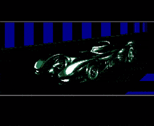

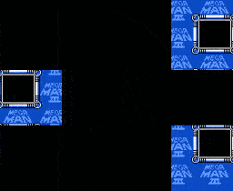
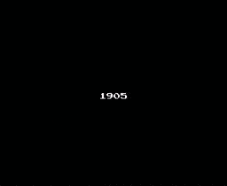
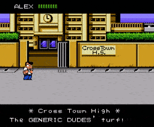
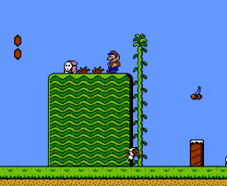
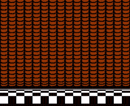
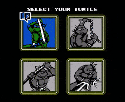
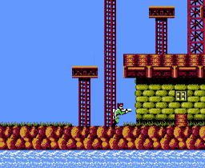
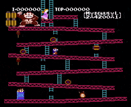
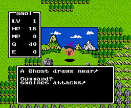
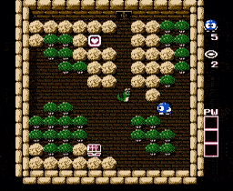
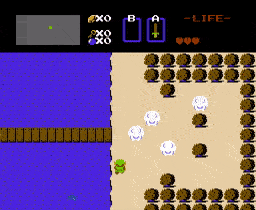
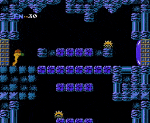
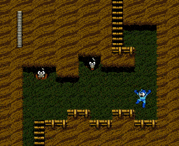
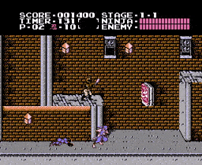

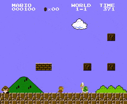
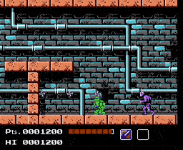
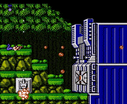

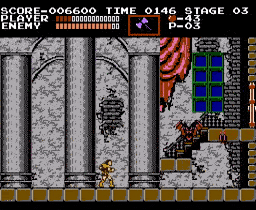
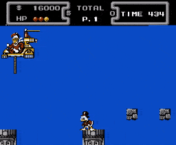
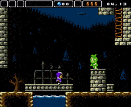
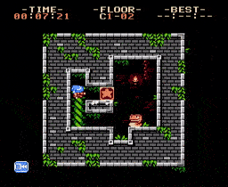
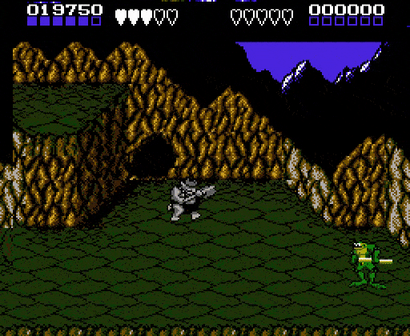
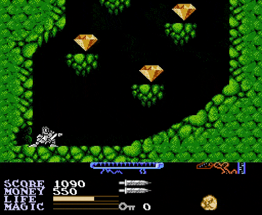
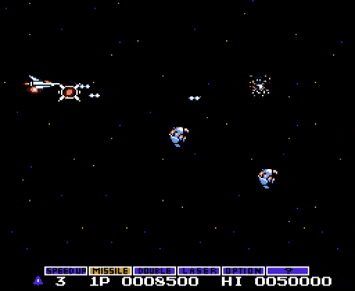

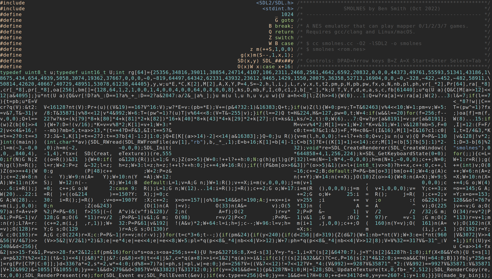

## Building

Probably only builds on Linux and macOS. Try gcc or clang.

```
$ make
```

## Running

```
$ ./smolnes <rom.nes>
```

Keys:

| Action | Key |
| --- | --- |
| DPAD-UP | <kbd>↑</kbd> |
| DPAD-DOWN | <kbd>↓</kbd> |
| DPAD-LEFT | <kbd>←</kbd> |
| DPAD-RIGHT | <kbd>→</kbd> |
| B | <kbd>Z</kbd> |
| A | <kbd>X</kbd> |
| START | <kbd>Enter</kbd> |
| SELECT | <kbd>Tab</kbd> |

## Updating keys

Look for line 19 in the source code. The following table shows which
numbers map to which keyboard keys:

| number | default key | NES button |
| - | - | - |
| 27 | X | A Button |
| 29 | Z | B Button |
| 43 | Tab | Select Button |
| 40 | Return | Start Button |
| 79 | Arrow Right | DPAD Right |
| 80 | Arrow Left | DPAD Left |
| 81 | Arrow Down | DPAD Down |
| 82 | Arrow Up | DPAD Up |

Replace the numbers on this line with one from the [SDL scancode list](https://github.com/libsdl-org/SDL/blob/SDL2/include/SDL_scancode.h).

